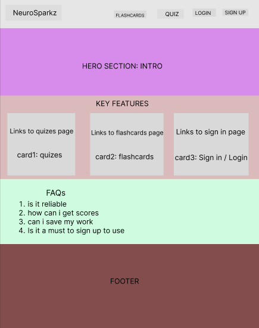
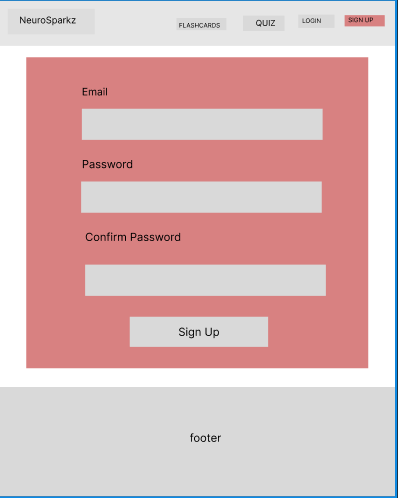
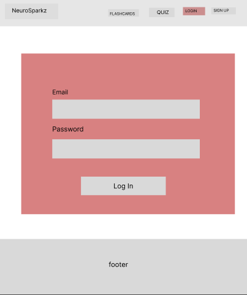
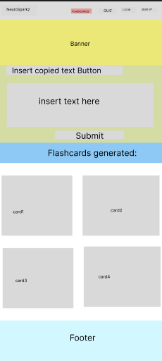
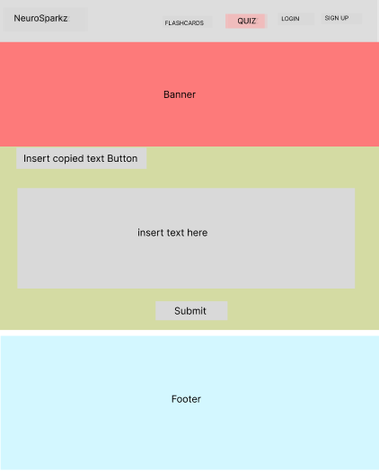
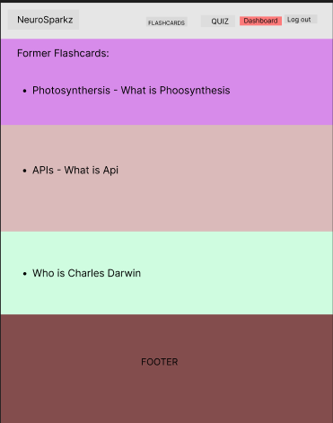

# Project Title
NeuroSparkz

## Overview

NeuroSparks is study-tool web application that allows users(mostly students) upload a copy of their notes/article and the app generates flashcards and quizes based on the uploaded data. The main goal is enhancing learning for users by making the brain actively engage with the materials

### Problem

Students and self-learners often struggle with retaining and recalling information efficiently. Traditional note-taking can be passive, and creating study materials manually is time-consuming. NeuroSparkz solves this problem by automatically generating flashcards and quizzes from study materials, helping users stay on top of their study game.

### User Profile

Students looking for a smart way to revise content.

Self-learners looking for an interactive study tool.

Researchers & professionals aiming to recall key concepts easily.

### Features

- As a user, I want to upload copy of my notes or an article so that I can generate flashcards.

- As a user, I want to generate quizzes based on my uploaded content to test my knowledge.

- As a user, I want to log in and access my study materials on a dashboard.

- As a user, I want to take quizzes without saving them.

- As a user, I want to generate flashcards and having an option of saving them.

- As a user, I want a clean and user-friendly interface for an efficient study experience.

## Implementation

### Tech Stack

- Frontend: React, TypeScript

- Backend: Express.js, Node.js

- Database: MySQL

- Client Libraries:

    - react

    - react-router

    - axios

- Server Libraries:

    - express

    - knex

    - bcrypt for authentication

    - jsonwebtoken for user sessions

### APIs

- Gemini Api - https://ai.google.dev/gemini-api/docs

### Sitemap

- Home page
- Flashcards page
- Quiz page
- Sign up
- Login
- Dashboard

### Mockups

#### Home Page


#### Register Page


#### Login Page


#### Flashcard Page before flashcard is generated


#### Flashcard after Flashcrad is generated


#### Quiz Page


#### Quiz Page after Quiz is Generated  


#### Dashboard only after sign up



### Data


### Endpoints

**POST /signup**

- Register a new user account.

- Parameters:

    - email: User's email (string)
    - password: User's password (string)

Response:


Response:
```
{
    "token": "eyJhbGciOiJIUzI1NiIsInR5cCI6IkpXVCJ9.eyJzdWIiOiIxMjM0NTY3ODkwIiwibmFtZSI6I..."
}


```

**POST /login**

- Log in a user and return a JWT token.

- Parameters:
    - email: User's email (string)
    - password: User's password (string)

- Response:

Response:
```
{
    "token": "eyJhbGciOiJIUzI1NiIsInR5cCI6IkpXVCJ9.eyJzdWIiOiIxMjM0NTY3ODkwIiwibmFtZSI6I..."
}


```

**POST /generate-flashcards**

- Generate flashcards based on uploaded study material.

- Parameters:
    - file: User-uploaded study material (text)

- Response:
```
{
    "flashcards": [
        {
            "id": 1,
            "key_point": "Photosynthesis",
            "explanation": "Photosynthesis is the process by which plants convert light energy into chemical energy, which they store as glucose."
        },
        {
            "id": 2,
            "key_point": "The Capital of France",
            "explanation": "Paris is the capital and most populous city of France, known for landmarks like the Eiffel Tower and Louvre Museum."
        }
    ]
}


```

**POST /generate-quiz**

- Generate a quiz based on the uploaded study material.

- Parameters:

    - file: User-uploaded study material (text, PDF, etc.)


- Response:
```
{
    "quiz": [
        {
            "id": 1,
            "question": "What is the main source of energy for plants?",
            "options": ["Sunlight", "Water", "Oxygen"],
            "answer": "Sunlight"
        },
        {
            "id": 2,
            "question": "What is the capital of France?",
            "options": ["Paris", "London", "Berlin"],
            "answer": "Paris"
        }
    ]
}

```

**GET /dashboard**

- Retrieve the saved flashcards for a logged-in user. This endpoint will return the flashcards that the user has previously saved.

- Parameters:

    - userId: The ID of the logged-in user to fetch their   saved flashcards.

    - token: JWT token used for user authentication (optional if you have a middleware to validate the user session).

- Response:
```
{
    "flashcards": [
        {
            "id": 1,
            "key_point": "Photosynthesis",
            "explanation": "Photosynthesis is the process by which plants convert light energy into chemical energy, which they store as glucose."
        },
        {
            "id": 2,
            "key_point": "The Capital of France",
            "explanation": "Paris is the capital and most populous city of France, known for landmarks like the Eiffel Tower and Louvre Museum."
        }
    ]
}

```


### Auth
- JWT Authentication: 
    - All requests requiring user login will use JWT tokens.
    - Store JWT in localStorage or sessionStorage on the client.
    - Include JWT in request headers to authenticate.
    -Remove JWT from storage upon logout.

## Roadmap

- Create client
    - React Project Setup:
        - Set up a basic React app using create-react-app.
        - Set up routes for pages such as the Home page, Login, Register, Flashcard page, and Quiz page.

- Create server
    - Express Setup:
        - Create an Express server with basic routes for quiz generation, flashcard generation, user authentication, and data management.
        - Set up placeholder responses for all endpoints, ensuring a 200 status for now.

- Create migrations
    - Database Migrations:
        - Set up migrations for tables like users and flashcards. You'll need these for user management and storing flashcards.
        - Knex for creating and managing migrations.

- Deploy client and server projects so all commits will be reflected in production

- Feature: Home Page

    - Implement main landing page with introduction and     navigation options
    - Provide links to other pages like Quiz, Flashcard, and Dashboard


- Feature: Quiz Page

    - Implement page for generating and taking quizzes based on uploaded content
    - Create POST /generate-quiz endpoint to generate quiz from user-uploaded content


- Feature: Flashcard Page

    - Implement page for generating and viewing flashcards from uploaded study material
    - Create POST /generate-flashcards endpoint to generate flashcards from user-uploaded content


- Feature: Dashboard

    - Implement dashboard page where users can view saved flashcards and quizzes
    - Create GET /dashboard/flashcards endpoint to retrieve saved flashcards for a logged-in user

- Bug fixes

- DEMO DAY

## Nice-to-haves

- Choose number of quiz questions

    - Allow users to select how many questions they want in a quiz.

- Choose quiz complexity

    - Let users choose the difficulty level (easy, medium, hard) for the quiz.

- Timer for quiz

    - Add a timer feature for quizzes to limit the time users have to answer.

- Immediate feedback on quiz questions

    - Provide instant feedback on answers right after each question.

- Saved quizzes and scores on the dashboard

    - Store and display the user's saved quizzes and their scores on their dashboard for easy tracking.

- Scoreboard for all users

    - Display a global scoreboard that shows the highest scores from all users for a competitive edge.